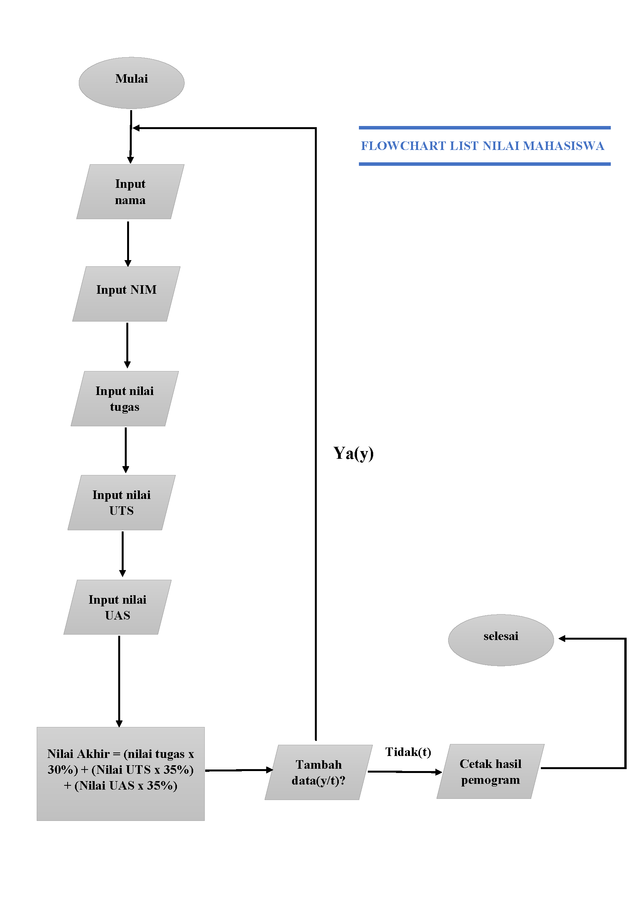

# labspy04
Labspy04 is a trial code for list in python

-> Latihan 1
Latihan yang pertama adalah membuat list dengan menulis:

list=[] 

(keterangan: list dapat diubah dengan nilai lainnya misal list1, atau nama lainnya)

berikut penulisan dalam python:

dengan keterangan:

list=["a", "b", "c", "d", "e"]

*diatas adalah isi list nya

print("Tampilkan Element ke 3:", list[2])

*diatas adalah perintah untuk menampilkan elemen ke 3 dalam list, karena elemen ke 3 ada di index 2, maka didalam list pakai kurung siku[2]

print("ambil Element ke 2 sampai 4:", list[1:4]) 

*diatas untuk perintah untuk mengambil elemn ke 2 sampai ke 4 dengan index elemen ada di index 1 sampai 4

print("ambil elemen terakhir:", list[5-1])

*sedangkan diatas ini adalah perintah untuk mengambil elemen terakhir, karena di dalam list ada 5 elemen, maka digunakan -1 untuk mengambil elemen terakhir

-> merubah elemen ke 4 dengan nilai lain

list[3] = "f" 

*sedangkan ini untuk merubah elemen ke 4 dengan nilai F, karena elemen ke 4 ada di index 3, maka ditulis list[3]

print("merubah elemen ke 4 dengan nilai lain:", list)

*merubah elemen ke 4 sampai terakhir

list[3:] = "f", "g" 

*ini untuk merubah elemen ke 4 sampai terakhir dengan string "f" dan "g". maka ditulis list[3:]

print("merubah elemen ke 4 sampai elemen terakhir:", list)
berikut hasil pemogramannya:

-> Latihan untuk menambahkan elemen dalam list:
berikut gambar program nya:

-> tambah elemen list
a=[1,2,3,4,5]
b=[6,7,8,9,10]

*diatas adalah untuk membuat 2 list

-> Ambil 2 bagian list A ke list B

b.append(a[1:3])
print("2 bagian List A dijadikan List B:", b)

*diatas adalah code untuk menambahkan list A kedalam list B dengan menggunakan perintah append

-> tambah list b dengan string

b.append("saya")
print("Tambah B dengan Sring:", b)

*diatas adalah untuk menambahkan list B dengan string menggunakan append
-> tambah list b dengan 3 nilai

print("Tambah list b dengan 3 nilai:", b+[11,12,13])

*diatas adalah untuk menambahkan list b dengan 3 nilai dengan menggunakan arithmatic +
-> Gabungan List B dan A

c=b+a
print("Gabungan list B dan A:", c)

*dan yang di atas ini adalah untuk menggabungkan list B dan list A, menjadi list C

Berikut hasil programnya:

#Praktikum Labs 4

-> Membuat list nilai Mahasiswa

*flowchart programnya adalah sebagai berikut:

*Berikut gambar programnya:

*Keterangan:

i=0

*diatas adalah untuk menginisiasikan variable i sama dengan 0, karena diprogram ini akan menggunakan perulangan while dan for, jadi perlu di inisiasikan agar tidak terjadi error

nama=[]
nim=[]
tugas=[]
uts=[]
uas=[]
nilai_akhir=[]

*diatas adalah untuk mendefinisikan list nya, terdapat list untuk menampung nama, nim, tugas, uts, uas, dan nilai akhir

while True:
    s_nama=input("Nama  : ")
    nama.append(s_nama)
    s_nim=input("NIM    : ")
    nim.append(s_nim)
    i_tugas=input("Nilai Tugas  : ")
    tugas.append(i_tugas)
    i_uts=input("Nilai UTS  : ")
    uts.append(i_uts)
    i_uas=input("Nilai UAS    : ")
    uas.append(i_uas)

*diatas adalah code untuk menginput isi dalam list tersebut, juga untuk menambahkan list jika sudah menginput 1 nama atau nilai dalam list, dengan menggunakan append dan menggunakan pengulangan while

i_nilai_akhir=(int(i_tugas)*0.30)+(int(i_uts)*0.35)+(int(i_uas)*0.35)
nilai_akhir.append(i_nilai_akhir)

*diatas adalah code untuk menghitung nilai akhir dengan kondisi nilai akhir 30% dari nilai tugas, ditambah 35% dari nilai UTS dan juga 35% dari nilai UAS, dengan kemudian diubah persentase menjadi bentuk desimal, maka terdapat 0.30, 0.35. sedangkan untuk nilai_akhir.append adalah untuk menambahkan list dari yang telah di inputkan sebelum akhirnya di tampilkan

more=""
   while more!="y" and more!="t":
    more=input("Tambah Data (y/t) ?")
i+=1
if more=="t":
    break

*sedangkan code diatas adalah untuk perintah menambahkan data dengan pertanyaan ya atau tidak, dengan definisi jika ya, maka ketikkan y pada keyboard, maka akan mengulang inputan list. dan jika tidak, ketikkan t paada keyboard, maka akan menampilkan hasil list yang telah di inputkan

print("                                       Daftar Mahasiswa                               ")
print("======================================================================================")
print("|    No.    |    Nama    |   NIM    |    Tugas   |   UTS    |    UAS    |    Akhir   |")
print("======================================================================================")
diatas untuk membuat border agar terlihat rapi
for n in range(i):
    print("|    ",n+1,"    |    ",nama[n],"    |   ",nim[n],"    |    ",tugas[n],"   |   ",uts[n],"    |    ",uas[n],"    |    ",nilai_akhir[n],"   |")
*sedangkan yang diatas adalah untuk menampilkan hasil dari list yang telah di inputkan, dengan menggunakan perulangan for n in range. dan berikut hasil dari code programnya:

# Sekian Praktikum Labs 4 ini